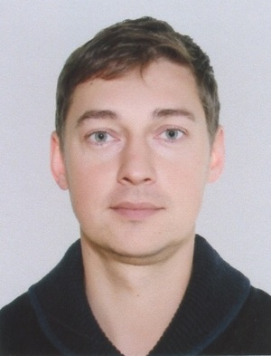

# Привет, меня зовут Владимир!

Я программист на Python с опытом работы в различных областях, включая разработку веб-приложений, анализ данных и автоматизацию.

## О себе

- **Владимир Пузенко**
- **Опыт**: 1 год опыта работы с Python
- **Навыки**: 
  - Python
  - Django/Flask
  - SQL
  - Библиотеки: Pandas, NumPy, Matplotlib

## Проекты

- [Site-For-Import](https://github.com/Vladimirrus8/Site-For-Import.git) - разработка веб-приложения.

